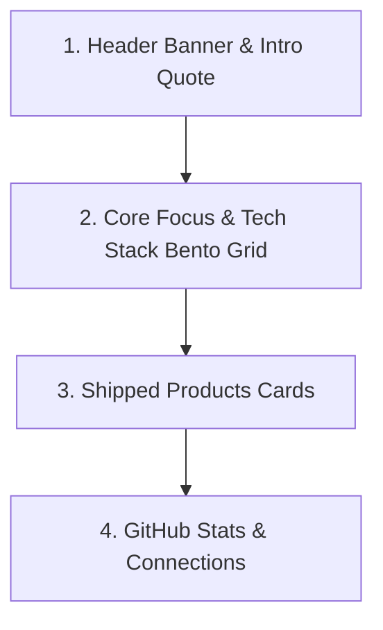

# Design Document: GitHub Profile README for Web3/Finance TPM

## 1. Overview
This document specifies the design and implementation of a professional, premium-grade GitHub profile README tailored for a Technical Product Manager specializing in Blockchain, Finance, Python, Solidity/EVM, and the Sui Ecosystem.

The layout is inspired by the modern Bento Grid design, offering a balance of technical expertise (code stats, tech stack) and product/leadership impact (metrics, shipped products).

---

## 2. Architecture & Layout Structure

The profile README will consist of 4 distinct visual sections structured using a combination of standard Markdown and aligned HTML to ensure consistent rendering across both mobile and desktop views on GitHub.

### Section 1: Header Banner & Intro Quote
* **Goal:** Set a professional Web3/Finance tone and display personal developer philosophy.
* **Elements:**
  * Clean, dark-themed banner image.
  * Headline: `Technical Product Manager | Web3 & Finance Expert`.
  * Quote block featuring Terry A. Davis: *"I write code to prove my sanity."*

### Section 2: Core Focus & Tech Stack (Bento Grid)
* **Goal:** Showcase the dual-nature of a TPM (business/strategy and deep-tech).
* **Structure:** A 2-column layout built with a borderless HTML table:
  * **Column A (Left):** Core PM & Blockchain focus points (EVM, SUI, Financial Engineering, Tokenomics).
  * **Column B (Right):** Categorized tech badges (Languages: Python, Solidity, Move; Ecosystems: EVM, Sui; Tools: Jira, Productboard).

### Section 3: Shipped Products & Portfolio
* **Goal:** Demonstrate tangible business and technical delivery.
* **Structure:** Vertical stack of HTML styled cards containing:
  * Timeline tags.
  * Role descriptions (TPM, Architect).
  * Tech stack shields used in the product.
  * Key performance indicators (KPIs) and impact metrics (TVL, transaction volumes, latencies).

### Section 4: Activity Stats & Connection Channels
* **Goal:** Provide social proof and contact mechanisms.
* **Elements:**
  * Side-by-side GitHub statistics cards (tokyonight theme, borderless, matching `#0d1117` GitHub dark background).
  * Profile visitor counter.
  * Clickable social badges (LinkedIn, Twitter/X, Telegram, Email).

---

## 3. Configuration Variables
The README will use placeholders for the user to customize. The placeholders will be clearly highlighted:
* `YOUR_GITHUB_USERNAME`
* `YOUR_NAME`
* `YOUR_LINKEDIN_USERNAME`
* `YOUR_TWITTER_USERNAME`
* `YOUR_TELEGRAM_USERNAME`
* `YOUR_EMAIL_ADDRESS`

---

## 4. Implementation Details & Styling Guidelines
* All HTML containers should use `background-color: #0d1117;` and `border: 1px solid #30363d;` to integrate seamlessly with GitHub's native dark mode.
* Images and badges should use standard Shields.io configurations with `flat-square` or `for-the-badge` style parameters.
* The file will be named `README.md` and located in the workspace root.
